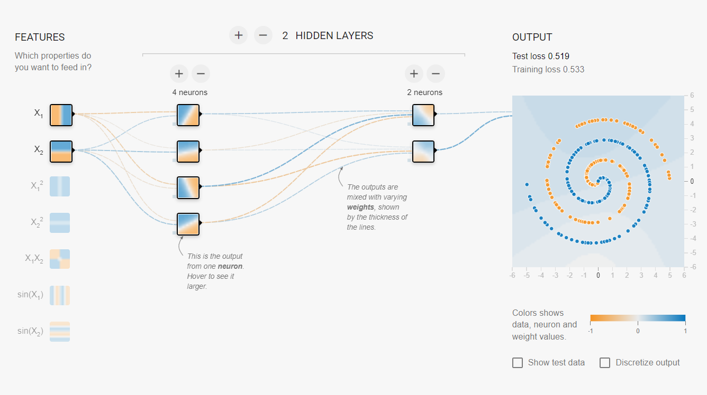
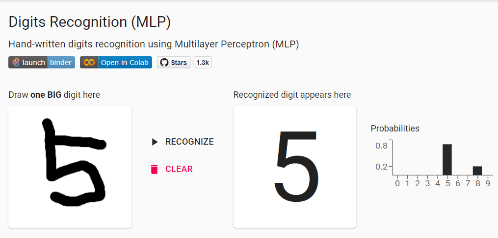
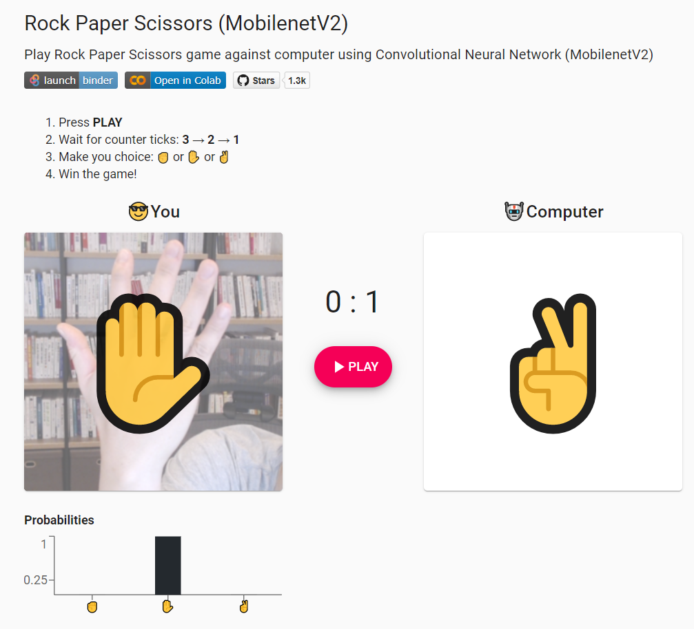
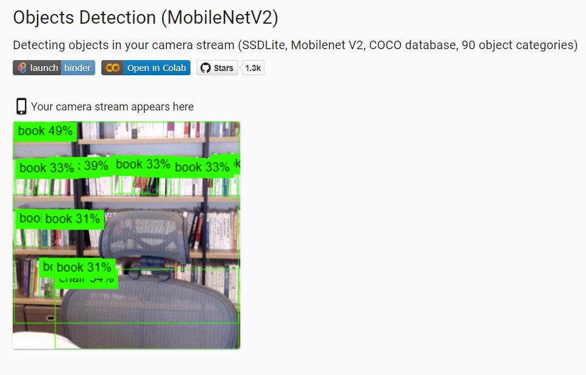
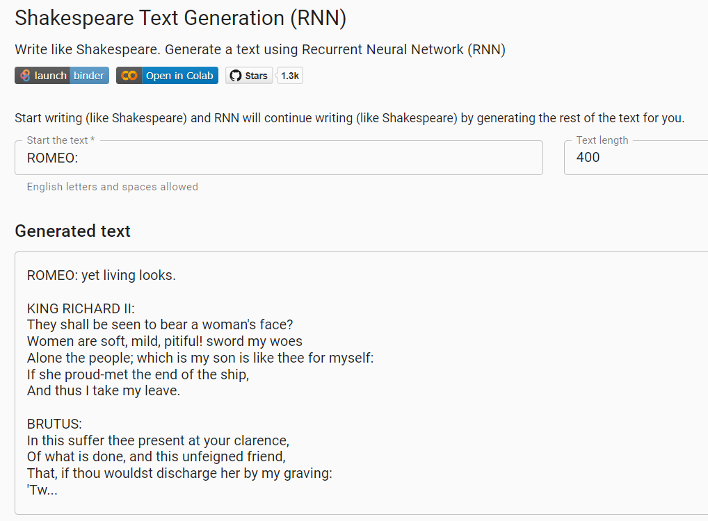

## 인공지능 놀이터 (Play Ground)

### - 인공신경망 분류기 학습 [**(링크)**](http://playground.tensorflow.org/#activation=tanh&batchSize=10&dataset=circle&regDataset=reg-plane&learningRate=0.03&regularizationRate=0&noise=0&networkShape=4,2&seed=0.31638&showTestData=false&discretize=false&percTrainData=50&x=true&y=true&xTimesY=false&xSquared=false&ySquared=false&cosX=false&sinX=false&cosY=false&sinY=false&collectStats=false&problem=classification&initZero=false&hideText=false!)

### - 직접 손글씨 입력 데이터를 가지고 분류기 만들기 [**(링크)**](https://trekhleb.github.io/machine-learning-experiments/#/experiments/DigitsRecognitionMLP)

### - 가위바위보 게임 [**(링크)**](https://trekhleb.dev/machine-learning-experiments/#/experiments/RockPaperScissorsMobilenetV2)

### - 객체 인식(사물 인식) [**(링크)**](https://trekhleb.dev/machine-learning-experiments/#/experiments/ObjectsDetectionSSDLiteMobilenetV2)

### - 셰익스피어 문체의 글 생성하기 [**(링크)**](https://trekhleb.dev/machine-learning-experiments/#/experiments/TextGenerationShakespeareRNN)

